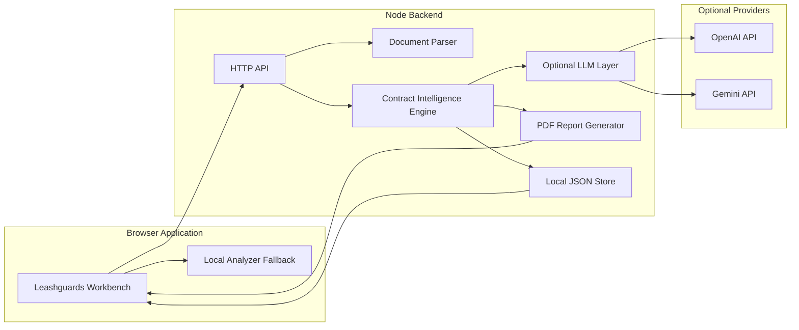

# Architecture Diagram

```mermaid
flowchart LR
  subgraph Client[Browser Application]
    UI[Leashguards Workbench]
    LocalFallback[Local Analyzer Fallback]
  end

  subgraph Server[Node Backend]
    API[HTTP API]
    Parser[Document Parser]
    Analyzer[Contract Intelligence Engine]
    LLM[Optional LLM Layer]
    PDF[PDF Report Generator]
    Store[Local JSON Store]
  end

  subgraph Providers[Optional Providers]
    OpenAI[OpenAI API]
    Gemini[Gemini API]
  end

  UI --> API
  UI --> LocalFallback
  API --> Parser
  API --> Analyzer
  Analyzer --> LLM
  LLM --> OpenAI
  LLM --> Gemini
  Analyzer --> PDF
  Analyzer --> Store
  PDF --> UI
  Store --> UI
```

