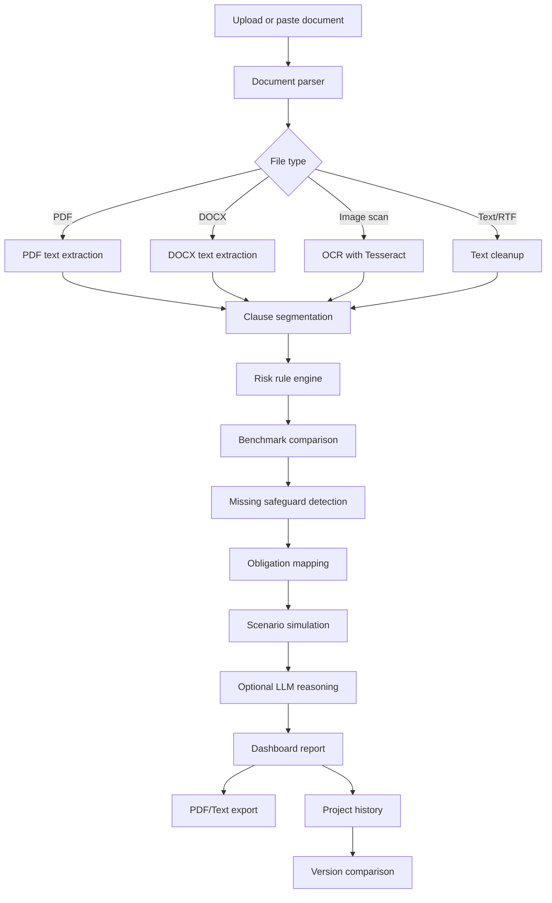

# Workflow Diagram

```mermaid
flowchart TD
  A[Upload or paste document] --> B[Document parser]
  B --> C{File type}
  C -->|PDF| D[PDF text extraction]
  C -->|DOCX| E[DOCX text extraction]
  C -->|Image scan| F[OCR with Tesseract]
  C -->|Text/RTF| G[Text cleanup]
  D --> H[Clause segmentation]
  E --> H
  F --> H
  G --> H
  H --> I[Risk rule engine]
  I --> J[Benchmark comparison]
  J --> K[Missing safeguard detection]
  K --> L[Obligation mapping]
  L --> M[Scenario simulation]
  M --> N[Optional LLM reasoning]
  N --> O[Dashboard report]
  O --> P[PDF/Text export]
  O --> Q[Project history]
  Q --> R[Version comparison]
```

